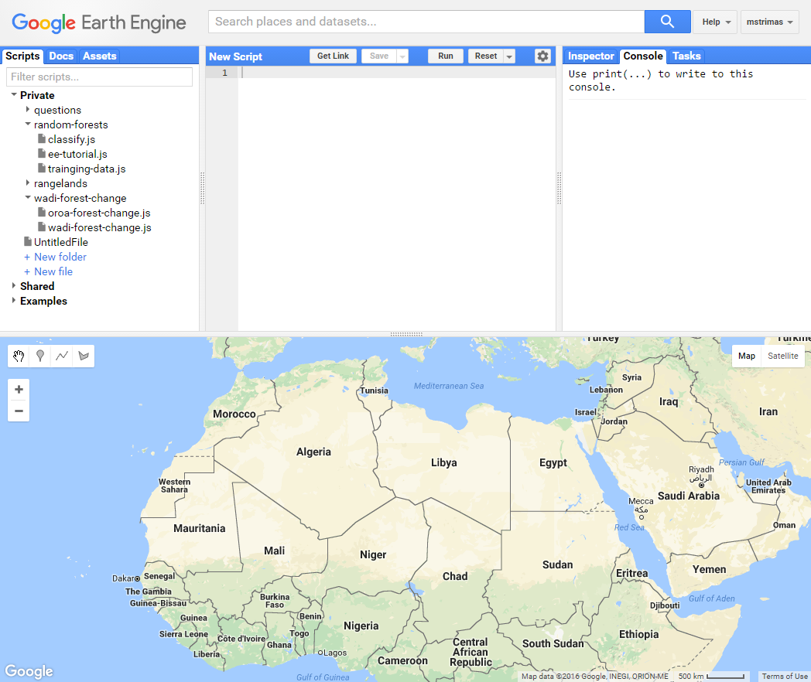
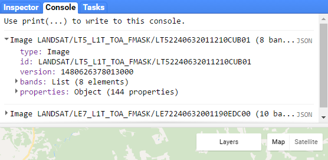
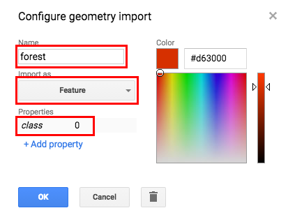
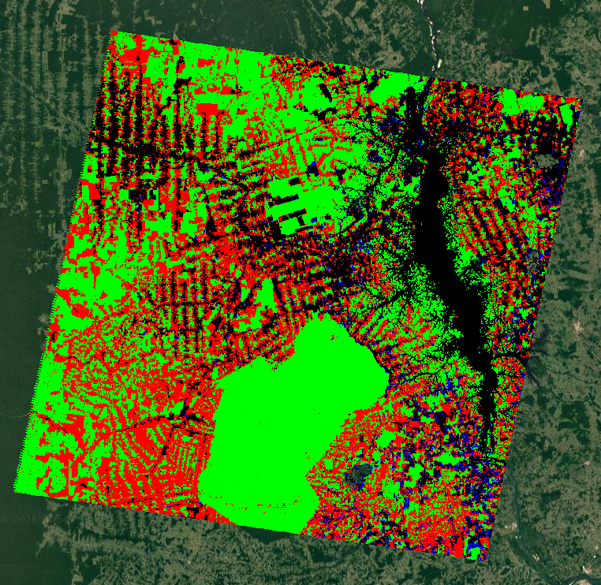

# Land-cover Change Mapping with Earth Engine

[Google Earth Engine](https://earthengine.google.com/) is a [cloud computing](https://en.wikipedia.org/wiki/Cloud_computing) platform for planetary-scale remote sensing analyses. It provides access to a multi-petabyte catalog of satellite imagery and geospatial datasets, including almost the entire catalogs of Landsat, MODIS, and Sentinel imagery, as well as derived products such as NDVI, land-cover classifications, and forest change maps. In addition, Earth Engine allows users to take advantage of Google's powerful computing infrastructure to process this imagery.

One of the earliest, and highest profile, applications of Earth Engine was the production of a [global forest change map](https://earthenginepartners.appspot.com/science-2013-global-forest/download_v1.2.html) by Matt Hansen and his team at University of Maryland. In this tutorial, we'll demonstrate the use of Earth Engine by conducting a similar analysis, but at a much smaller scale. We'll map forest cover change between 2001 and 2011 within a single Landsat scene in Brazil.

## Getting started with Earth Engine

Before you use Earth Engine you'll need to [sign up for a free account](https://earthengine.google.com/signup). Once you have your account, it is suggested you complete the [Introduction to Earth Engine tutorial](https://developers.google.com/earth-engine/tutorials). More detailed tutorials for specific tasks can be accessed via the [Earth Engine Guides](https://developers.google.com/earth-engine/).

Throughout this tutorial, we'll be working within the [Earth Engine Playground](https://code.earthengine.google.com/) (pictured below). In the top left pane, use the *Scripts* tab to manage scripts for different analyses and the *Docs* tab to access documentation for all the functions made available through Earth Engine. In the top right pane, the *Console* tab will display any objects you `print()` within your scripts. The *Map* (lower pane) is used to visualize geospatial datasets. Finally, the *Code Editor* (top middle pane) is where you write JavaScript code to perform your analysis. It's also possible to use Earth Engine via a Python API, however, in this tutorial we'll stick with JavaScript because it will allow us to use the Code Editor.

<center>

</center>

## Load imagery

In this tutorial, we'll produce a map of forest change between 2001 and 2011 in a small area of Brazil. To do so, we need satellite imagery of the study region for both 2001 and 2011, ideally at the same time of year to remove seasonality as a confounding variable. The Landsat satellites are a good candidate here: they revisit the same area every 16 days, have 30m resolution, and the entire catalog going back to 1972 is available on Earth Engine.

Try searching the [Earth Explorer data catalog for "landsat"](https://explorer.earthengine.google.com/#search/landsat) to see what data sets are available. You'll notice that image collections are available for each of the different Landsat satellites and for various levels of processing. We'll use the Orthorectified Top of Atmosphere (TOA) reflectance collections for [Landsat 5](https://explorer.earthengine.google.com/#detail/LANDSAT%2FLT5_L1T_TOA_FMASK) and [Landsat 7](https://explorer.earthengine.google.com/#detail/LANDSAT%2FLE7_L1T_TOA_FMASK). Each collection is identified by a unique **ImageCollection ID** (e.g. `LANDSAT/LT5_L1T_TOA_FMASK`) and consists of every Landsat scene taken by that satellite, each of which is identified by a unique **Image ID** (e.g. `LANDSAT/LT5_L1T_TOA_FMASK/LT52240632011210CUB01`).

For the sake of this tutorial we've chosen two Landsat scenes from July 2001 and July 2011, respectively, that will form the basis of our analysis. To load and view these scenes paste the following code in your [Code Editor](https://code.earthengine.google.com/):

```javascript
//// load landsat scenes for 2001 & 2011 in Brazil
// landsat 5 - 2011-07-29
var ls5 = ee.Image('LANDSAT/LT5_L1T_TOA_FMASK/LT52240632011210CUB01');
print(ls5);

// landsat 7 - 2001-07-09
var ls7 = ee.Image('LANDSAT/LE7_L1T_TOA_FMASK/LE72240632001190EDC00');
print(ls7);

// plot true colour composites
Map.addLayer(ls5, {bands: ['B3', 'B2', 'B1'], gamma: 1.5}, '2011');
Map.addLayer(ls7, {bands: ['B3', 'B2', 'B1'], gamma: 1.5}, '2001');
Map.centerObject(combined, 9);
```

In the map pane, you should now see these Landsat scene overlaid. In the top left corner of the map, click the *Layer* button to toggle whether you see the 2001 or 2011 scene. The use of `{bands: ['B3', 'B2', 'B1']}` in the `Map.addLayers()` call tells Earth Engine which bands to plot, in this case a true colour composite is produced. Try using `{bands: ['B4', 'B3', 'B2']}` to get a standard false colour composite highlighting vegetation. In addition to the map, the `print()` statements in the code print the metadata of the images to the *Console* (top right pane). You can explore the images here, for example, to see what bands are available.

<center>

</center>

### Mask clouds and shadows

These images have been specifically chosen to have very limited cloud cover, however, there is some and we'd like mask out these cloudy pixels and remove them from our analysis. Fortunately, the Landsat collections we're working with contain an extra `fmask` band with an integer indicating whether a given pixel is shadow (2), snow (3), or cloud (4). We'll extract this band, convert it to binary (1 for pixels to keep, 0 for pixels to mask due to cloud or shadow), then use this to mask the original images. I'll also rename the bands so we can distinguish between the years.

```javascript
//// landsat scenes for 2001 & 2011 in Brazil
// landsat 5 - 2011
var ls5 = ee.Image('LANDSAT/LT5_L1T_TOA_FMASK/LT52240632011210CUB01');
// create binary mask band for clouds and shadows
var ls5Mask = ls5.select('fmask').lt(2);
// select bands 1-5 and rename to append year
ls5 = ls5.
  select(['B1', 'B2', 'B3', 'B4', 'B5']).
  rename(['B1_2011', 'B2_2011', 'B3_2011', 'B4_2011', 'B5_2011']);
// mask out clouds
ls5 = ls5.updateMask(ls5Mask);

// landsat 7 - 2001
var ls7 = ee.Image('LANDSAT/LE7_L1T_TOA_FMASK/LE72240632001190EDC00');
// create binary mask band for clouds and shadows
var ls7Mask = ls7.select('fmask').lt(2);
// select bands 1-5 and rename to append year
ls7 = ls7.
  select(['B1', 'B2', 'B3', 'B4', 'B5']).
  rename(['B1_2001', 'B2_2001', 'B3_2001', 'B4_2001', 'B5_2001']);
// mask out clouds
ls7 = ls7.updateMask(ls7Mask);

// plot true colour composites
Map.addLayer(ls5, {bands: ['B3_2011', 'B2_2011', 'B1_2011'], gamma: 1.5}, '2011');
Map.addLayer(ls7, {bands: ['B3_2001', 'B2_2001', 'B1_2001'], gamma: 1.5}, '2001');
Map.centerObject(ls7, 9);

```

Notice that these Landsat images now haves holes in them where the clouds were.

### Create multi-date stack

We're interested in identifying pixels that have changed from forest to non-forest (or vice versa) between 2001 and 2011. Therefore we need to stack these two scenes so we can analyze them simultaneously. I visualize this stack using by mapping the infrared band from 2011 to red and the infrared band from 2001 to both green and blue. In this composite, deforested areas will show up as red.

```javascript
//// landsat scenes for 2001 & 2011 in Brazil
// landsat 5 - 2011
var ls5 = ee.Image('LANDSAT/LT5_L1T_TOA_FMASK/LT52240632011210CUB01');
// create binary mask band for clouds and shadows
var ls5Mask = ls5.select('fmask').lt(2);
// select bands 1-5 and rename to append year
ls5 = ls5.
  select(['B1', 'B2', 'B3', 'B4', 'B5']).
  rename(['B1_2011', 'B2_2011', 'B3_2011', 'B4_2011', 'B5_2011']);
// mask out clouds
ls5 = ls5.updateMask(ls5Mask);

// landsat 7 - 2001
var ls7 = ee.Image('LANDSAT/LE7_L1T_TOA_FMASK/LE72240632001190EDC00');
// create binary mask band for clouds and shadows
var ls7Mask = ls7.select('fmask').lt(2);
// select bands 1-5 and rename to append year
ls7 = ls7.
  select(['B1', 'B2', 'B3', 'B4', 'B5']).
  rename(['B1_2001', 'B2_2001', 'B3_2001', 'B4_2001', 'B5_2001']);
// mask out clouds
ls7 = ls7.updateMask(ls7Mask);

// stack to create multi-date composite
var combined = ls7.addBands(ls5);
// mask clouds
var cloudMask = combined.updateMask(ls7Mask).updateMask(ls5Mask);

// plot true colour composites
Map.addLayer(ls5, {bands: ['B3_2011', 'B2_2011', 'B1_2011'], gamma: 1.5}, '2011');
Map.addLayer(ls7, {bands: ['B3_2001', 'B2_2001', 'B1_2001'], gamma: 1.5}, '2001');
// plot multi-date composite
Map.addLayer(combined, {bands: ['B5_2011', 'B5_2001', 'B5_2001'], gamma: 1.5}, 'combined');
Map.centerObject(combined, 9);
```

Try identifying a deforested area using the multi-date image, then turn this image off in the layer manager and flick between the 2001 and 2011 images to confirm that deforestation did in fact occur.

## Training polyons

We're going to perform a supervised forest change classification using the [random forests](https://en.wikipedia.org/wiki/Random_forest) algorithm. To do so, we need to provide this algorithm with training data, i.e. we need to delineate areas of known fate to characterized the spectral signatures of the different classes. In particular, we're interested in the following 4 classes:


| class|name       |description                 |
|-----:|:----------|:---------------------------|
|     0|forest     |forest in 2000 and 2011     |
|     1|forestLoss |forest loss                 |
|     2|nonforest  |non-forest in 2000 and 2011 |
|     3|forestGain |forest gain                 |

Earth Engine provides a tool for drawing polygons directly on the map, which we'll use to delineate polygons for each of the four classes. The goal is to capture as much of the variability within the class and possible, so we'll try for 4-6 polygons for each class capturing the full diversity of the class. To start, click on the polygon tool on the top left corner of the map, which creates a new polygon layer.

<center>

</center>

Now click on the gear icon next to this new layer and fill in the details as highlighter in the image below. This layer will be for the first class: forest unchanged between 2001 and 2011. You need to give it a name ("forest"), set the type as "Feature" rather than Geometry, and add a new "class"" attribute (this will be class 0).

<center>

</center>

Now use all three layers of satellite imagery to identify regions that remain forest throughout the study period and create some polygons delineating these areas. Keep your polygons small and remember to capture the diversity within this class. Once you're done with this class, move on to the to the other classes, making sure to create a new layer for each and fill out the correct information in the layer properties. Call your layers: forest, forestLoss, nonforest, and forestGain.

Once you're done, scroll up to the top of the code editor and you'll see a new section where these polygon layers are imported. Be sure to save your code at this point so you don't loose these polygons!

<center>

</center>

## Extract cell values

Finally, we need to combine these four training layers into one and extract the imagery cell values from within the polygons. This will produce a single table that associates pixels of each class with the spectral band values in those pixels. It's likely that when you selected polygons, some classes, such as unchanged forest, were easy to find examples of and therefore the training polygons for these classes cover a much larger area. Ideally we'd like the same number of training cells for each class. Furthermore, Earth Engine imposes usage limits and, if the training polygons contain too many cells, these limits will be exceeded and an error will be returned. To address this, we'll subsample within the polygons. Add the following code to the end of the script you already have.

```javascript
// subsample training polygons with random points
// this ensures all classes have same sample size
// also EE can't handle too many cells at once
var trainingLayers = [forest, forestLoss, nonforest, forestGain];
var n = 500;
// loop over training layers
for (var i = 0; i < trainingLayers.length; i++) { 
  // sample points within training polygons
  var pts = ee.FeatureCollection
    .randomPoints(trainingLayers[i].geometry(), n);
  // add class
  var thisClass = trainingLayers[i].get('class');
  pts = pts.map(function(f) {
    return f.set({class: thisClass});
  });
  // extract raster cell values
  var training = combined.sampleRegions(pts, ['class'], 30);
  // combine trainging regions together
  if (i === 0) {
    var trainingData = training;
  } else {
    trainingData = trainingData.merge(training);
  }
}
```

## Random forests

We now have our imagery and our training data and it's time to run the random forests classification. Add the following code to your script to fit a random forests model and plot the resulting forest change map.

```javascript
//// classify with random forests
// use bands 1-5 from each time period
var bands = ['B1_2001', 'B1_2011', 'B2_2001', 'B2_2011', 'B3_2001', 'B3_2011',
             'B4_2001', 'B4_2011', 'B5_2001', 'B5_2011'];
// fit a random forests model
var classifier = ee.Classifier.randomForest(30)
  .train(trainingData, 'class', bands);
// produce the forest change map
var classified = combined.classify(classifier);
var p = ['00ff00', 'ff0000', '000000', '0000ff'];
// display
Map.addLayer(classified, {palette: p, min: 0, max: 3}, 'classification');
```

Below is an example forest change map, yours may be slightly different since you likely chose different training areas. In this map forest is green, non-forest is black, forest loss is red, and forest gain is blue.

<center>

</center>

### Accuracy assessement

Before we make use of the map we just created it's important to know just how accurate it is. For example, if the classified map shows that forest loss occurred in a given area, how confident can we be that that area actually experienced forest loss?

A **confusion matrix** is the standard method for assessing the performance of a classification algorithm. It takes cases of known class (e.g. the training data or an independent validation data set) and compares them to their predicted class. The rows of the matrix are instances of the actual class, while the columns are instances of the predicted class. The diagonal of the matrix gives the number of correct classifications, while the off-diagonals give the number of incorrect classifications. For example, if we only had two classes, the matrix might look like:

$$
\begin{bmatrix}
10 & 2\\ 
3 & 5
\end{bmatrix}
$$

In this example, 10 out 12 cases of class 1 were correctly classified, while 5 out of 8 cases of class 2 were correctly classified Looking at the off-diagonal components, in 2 cases class 1 was incorrectly assigned to class 2, and in 3 cases class 2 was incorrectly assigned to class 1. The overall accuracy is the total number of correct classifications as a proportion of the total number of cases, which in this case is $15 / 20 = 75\%$.

To calculate the confusion matrix and overall accuracy for our forest change map add the following code to the end of your script:

```javascript
// accuracy assessement
var confMat = classifier.confusionMatrix();
print('Confusion matrix: ', confMat);
print('Overall accuracy: ', confMat.accuracy());
```

You should now see the confusion matrix and overall accuracy to the console:

<center>

</center>

In this case, our accuracy was quite good across all the classes, however, note that we used the training data to perform our validation. In practice it's best to collect an independent validation data set, or partition the training data set into training and validation subsets, in order to avoid bias in the accuracy assessment. This is possible in Earth Engine, however it is out of the scope of this tutorial.

## Conclusion

In this tutorial we used supervised classification to build a forest change map for a single Landsat scene in Brazil. However, this only scratches the surface of what's possible with Earth Engine. We could have extended our analysis to include a much larger region or to study land change in a different geographic location or biome. And, the applications aren't limited to land-cover change in the context of conservation, Earth Engine is broadly applicable to any task requiring analysis of spatiotemporal trends on the Earth's surface.

The [full script](https://code.earthengine.google.com/b2032d825436fe7e8018c3b64610cd89) for this tutorial is online. To learn more about Earth Engine complete the [Introduction to Earth Engine tutorial](https://developers.google.com/earth-engine/tutorials) if you haven't already. Then consult the [Earth Engine Guides](https://developers.google.com/earth-engine/), which provides excellent tutorials on all the major funcationality of Earth Engine. Finally, if at any point you get stuck, try reaching out to the [Earth Engine Google Group](https://groups.google.com/forum/#!forum/google-earth-engine-developers) for help.
